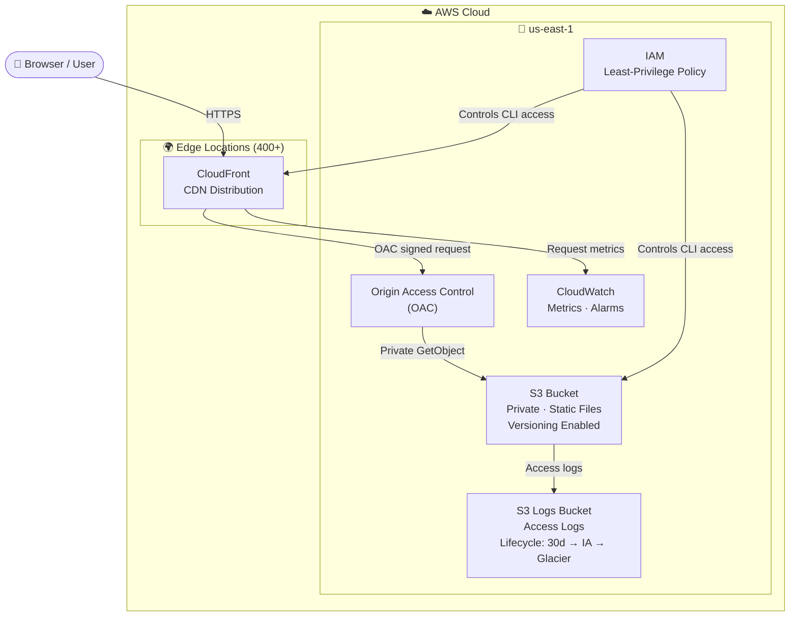
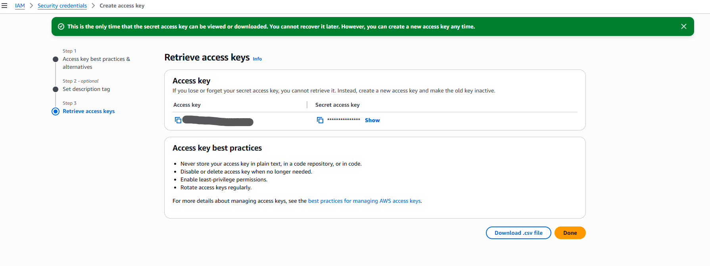
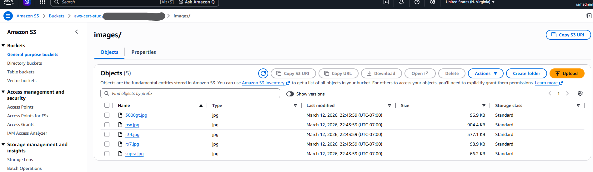
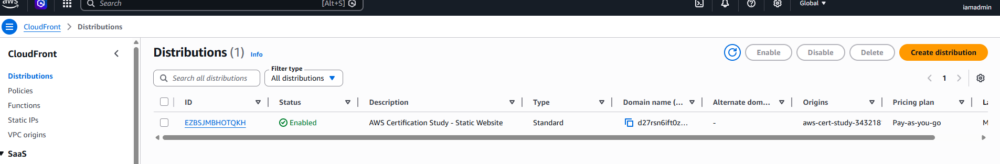
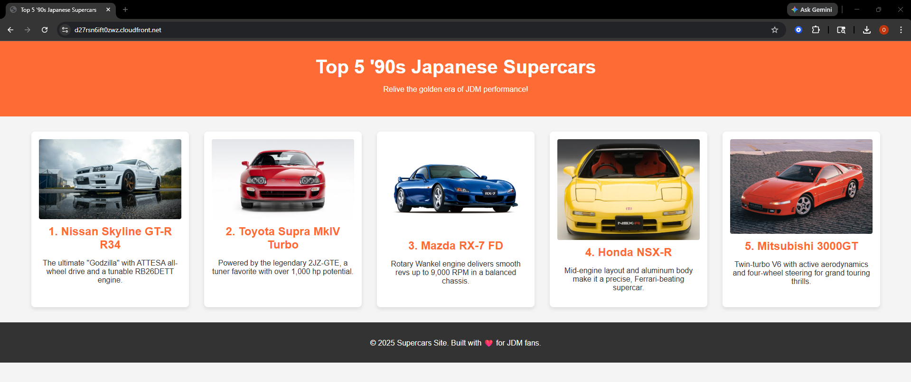
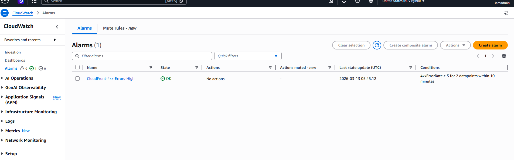

# Project 01: Static Website Hosting on AWS


Deploy a production-style static website on AWS using S3, CloudFront, IAM, and CloudWatch. This project covers the foundational services that appear on every AWS certification exam — Cloud Practitioner, Solutions Architect Associate, and Developer Associate — then tears everything down cleanly so you pay nothing.

---

## Quick Start

```bash
# Deploy everything (sets all environment variables automatically)
bash scripts/deploy.sh

# When done — always clean up
bash scripts/cleanup.sh
```

Or follow the step-by-step walkthrough below to learn each service as you build.

---

## Architecture



### Flow Summary

| Step | What Happens |
|------|-------------|
| 1 | User requests `https://<distribution>.cloudfront.net` |
| 2 | CloudFront checks edge cache — cache hit returns immediately |
| 3 | Cache miss: CloudFront fetches from S3 using OAC (no public bucket needed) |
| 4 | Response cached at edge, returned to user over HTTPS |
| 5 | S3 writes access logs to log bucket; CloudFront publishes metrics to CloudWatch |

**Services You Will Learn**:
| Service | AWS Exam Domain | What You Learn |
|---|---|---|
| S3 | Storage | Buckets, objects, policies, versioning, lifecycle |
| CloudFront | Networking/CDN | Distributions, origins, behaviors, caching |
| IAM | Security | Users, policies, least privilege, MFA |
| CloudWatch | Monitoring | Metrics, dashboards, alarms |
| AWS CLI | Operations | Authenticating and managing resources via CLI |

---

## Prerequisites

Before starting, ensure you have:

- [ ] An AWS account (free tier eligible — [create one here](https://aws.amazon.com/free/))
- [ ] AWS CLI v2 installed ([install guide](https://docs.aws.amazon.com/cli/latest/userguide/getting-started-install.html))
- [ ] A text editor (VS Code recommended)
- [ ] Basic terminal/command-line familiarity

**Verify your AWS CLI installation:**
```bash
aws --version
# Expected output: aws-cli/2.x.x Python/3.x.x ...
```

---

## FinOps: Cost Awareness (Read Before Starting)

This project is designed to stay within the AWS Free Tier. Here are the relevant free tier limits:

| Service | Free Tier Allowance | What We Use |
|---|---|---|
| S3 | 5 GB storage, 20,000 GET, 2,000 PUT requests/month | <1 MB, ~50 requests |
| CloudFront | 1 TB data transfer, 10M requests/month | Negligible |
| CloudWatch | 10 custom metrics, 3 dashboards, 1M API calls | 1 dashboard |

**If you exceed Free Tier** (unlikely for this project):
- S3: $0.023/GB storage + $0.0004/1,000 GET requests
- CloudFront: $0.0085/10,000 HTTPS requests (first 10M free)

**Golden Rule**: Always run the cleanup script at the end of each session.

---

## Module 1: IAM — Identity and Access Management

### Concept: Least Privilege Principle

Never use your AWS root account for daily work. Always create IAM users with only the permissions
needed for the task. This is a core concept tested on every AWS certification.

### Step 1.1 — Configure AWS CLI with your credentials

If you have not yet configured the CLI, run:
```bash
aws configure
# AWS Access Key ID: [your access key]
# AWS Secret Access Key: [your secret key]
# Default region name: us-east-1
# Default output format: json
```

Verify you are authenticated:
```bash
aws sts get-caller-identity
```

Expected output:
```json
{
    "UserId": "AIDAXXXXXXXXXXXXXXXXX",
    "Account": "123456789012",
    "Arn": "arn:aws:iam::123456789012:user/your-username"
}
```

> **Screenshot:** Take a screenshot of your terminal showing the `sts get-caller-identity` output.
> Save as `docs/screenshots/01-iam-caller-identity.png`

**Save your Account ID** — you will need it in later steps:
```bash
export AWS_ACCOUNT_ID=$(aws sts get-caller-identity --query Account --output text)
echo "Account ID: $AWS_ACCOUNT_ID"
```

### Step 1.2 — Understand IAM Policies

IAM policies are JSON documents that define what actions are allowed or denied on which resources.
Review the least-privilege policy we created for this project:

```bash
cat policies/s3-website-policy.json
```

**Key IAM Concepts for Certification**:
- **Effect**: `Allow` or `Deny` (Deny always wins)
- **Action**: The API call (e.g., `s3:PutObject`)
- **Resource**: What ARN the action applies to (use `*` sparingly)
- **Principal**: Who the policy applies to (in resource-based policies)

---

## Module 2: S3 — Simple Storage Service

### Concept: Object Storage vs Block Storage

S3 is **object storage** — flat key/value store, globally accessible via HTTP. Not a file system.
This distinction matters for the exam: use S3 for static assets, backups, logs; use EBS for OS
volumes and databases.

### Step 2.1 — Create the S3 Website Bucket

```bash
# Set your unique bucket name (must be globally unique across all AWS accounts)
export BUCKET_NAME="aws-cert-study-$(aws sts get-caller-identity --query Account --output text)-$(date +%s)"
echo "Bucket name: $BUCKET_NAME"

# Create the bucket (us-east-1 does NOT use --create-bucket-configuration)
aws s3api create-bucket \
    --bucket "$BUCKET_NAME" \
    --region us-east-1

# For any OTHER region, use this syntax instead:
# aws s3api create-bucket \
#     --bucket "$BUCKET_NAME" \
#     --region us-west-2 \
#     --create-bucket-configuration LocationConstraint=us-west-2
```

**Exam Note**: S3 bucket names are globally unique across ALL AWS accounts and regions.
Bucket names must be 3-63 characters, lowercase, no underscores.

### Step 2.2 — Enable Versioning

S3 Versioning protects against accidental deletion and overwrites.

```bash
aws s3api put-bucket-versioning \
    --bucket "$BUCKET_NAME" \
    --versioning-configuration Status=Enabled

# Verify versioning is enabled
aws s3api get-bucket-versioning --bucket "$BUCKET_NAME"
```

**Exam Note**: Once enabled, versioning can only be **suspended**, not disabled.

### Step 2.3 — Create and Upload the Website

Use the pre-built website files included in this project:

```bash
# Upload website files
aws s3 cp ./website/ \
    s3://$BUCKET_NAME/ \
    --recursive

# Verify upload
aws s3 ls s3://$BUCKET_NAME/
```

> **Screenshot:** In the AWS console, navigate to **S3 → your bucket → Objects tab** and take a screenshot showing the uploaded files.
> Save as `docs/screenshots/02-s3-objects-uploaded.png`

### Step 2.4 — Enable Static Website Hosting

```bash
aws s3api put-bucket-website \
    --bucket "$BUCKET_NAME" \
    --website-configuration '{
        "IndexDocument": {"Suffix": "index.html"},
        "ErrorDocument": {"Key": "error.html"}
    }'

# Get the website endpoint (for reference — we will use CloudFront in front of this)
echo "S3 Website URL: http://$BUCKET_NAME.s3-website-us-east-1.amazonaws.com"
```

### Step 2.5 — Block Public Access (Best Practice)

We will serve content through CloudFront, not directly from S3. Keep the bucket private:

```bash
aws s3api put-public-access-block \
    --bucket "$BUCKET_NAME" \
    --public-access-block-configuration \
        BlockPublicAcls=true,\
        IgnorePublicAcls=true,\
        BlockPublicPolicy=true,\
        RestrictPublicBuckets=true
```

**Exam Note**: S3 Block Public Access is a bucket-level OR account-level setting. Account-level
settings override bucket-level settings.

### Step 2.6 — Apply Tags

Tags are critical for cost allocation and resource management (a major FinOps principle):

```bash
aws s3api put-bucket-tagging \
    --bucket "$BUCKET_NAME" \
    --tagging '{
        "TagSet": [
            {"Key": "Project", "Value": "aws-cert-study"},
            {"Key": "Environment", "Value": "learning"},
            {"Key": "Owner", "Value": "your-name"},
            {"Key": "CostCenter", "Value": "personal-dev"},
            {"Key": "ManagedBy", "Value": "manual"}
        ]
    }'
```

**FinOps Best Practice**: Always tag resources with at minimum: Project, Environment, Owner.
Enable cost allocation tags in Billing Console to see per-project spend.

### Step 2.7 — Enable S3 Access Logging

```bash
# Create a separate logging bucket
export LOG_BUCKET_NAME="${BUCKET_NAME}-logs"

aws s3api create-bucket \
    --bucket "$LOG_BUCKET_NAME" \
    --region us-east-1

# Enable logging
aws s3api put-bucket-logging \
    --bucket "$BUCKET_NAME" \
    --bucket-logging-status '{
        "LoggingEnabled": {
            "TargetBucket": "'"$LOG_BUCKET_NAME"'",
            "TargetPrefix": "s3-access-logs/"
        }
    }'
```

---

## Module 3: CloudFront — Content Delivery Network

### Concept: Edge Locations vs Availability Zones vs Regions

- **Regions**: Geographic areas with multiple data centers (e.g., us-east-1 = N. Virginia)
- **Availability Zones (AZs)**: Isolated data centers within a region (e.g., us-east-1a, 1b, 1c)
- **Edge Locations**: 400+ global PoPs for caching — used by CloudFront, Route 53, Shield

**Exam Note**: CloudFront uses Edge Locations, NOT AZs or Regions for content delivery.

### Step 3.1 — Create CloudFront Origin Access Control (OAC)

OAC allows CloudFront to access your private S3 bucket without making the bucket public:

```bash
export OAC_ID=$(aws cloudfront create-origin-access-control \
    --origin-access-control-config '{
        "Name": "aws-cert-study-oac",
        "Description": "OAC for static website project",
        "SigningProtocol": "sigv4",
        "SigningBehavior": "always",
        "OriginAccessControlOriginType": "s3"
    }' \
    --query 'OriginAccessControl.Id' \
    --output text)

echo "OAC ID: $OAC_ID"
```

### Step 3.2 — Create CloudFront Distribution

```bash
export DISTRIBUTION_ID=$(aws cloudfront create-distribution \
    --distribution-config '{
        "CallerReference": "aws-cert-study-'$(date +%s)'",
        "Comment": "AWS Certification Study - Static Website",
        "DefaultCacheBehavior": {
            "TargetOriginId": "S3Origin",
            "ViewerProtocolPolicy": "redirect-to-https",
            "CachePolicyId": "658327ea-f89d-4fab-a63d-7e88639e58f6",
            "Compress": true
        },
        "Origins": {
            "Quantity": 1,
            "Items": [{
                "Id": "S3Origin",
                "DomainName": "'"$BUCKET_NAME"'.s3.amazonaws.com",
                "S3OriginConfig": {"OriginAccessIdentity": ""},
                "OriginAccessControlId": "'"$OAC_ID"'"
            }]
        },
        "Enabled": true,
        "DefaultRootObject": "index.html",
        "PriceClass": "PriceClass_100",
        "HttpVersion": "http2"
    }' \
    --query 'Distribution.Id' \
    --output text)

echo "Distribution ID: $DISTRIBUTION_ID"
```

**Exam Note**: `PriceClass_100` = US, Canada, Europe only (cheapest). `PriceClass_All` = all edge
locations (most expensive). For cost optimization, choose the price class matching your audience.

### Step 3.3 — Update S3 Bucket Policy to Allow CloudFront OAC

```bash
# Get your distribution ARN
export DISTRIBUTION_ARN="arn:aws:cloudfront::${AWS_ACCOUNT_ID}:distribution/${DISTRIBUTION_ID}"

aws s3api put-bucket-policy \
    --bucket "$BUCKET_NAME" \
    --policy '{
        "Version": "2012-10-17",
        "Statement": [{
            "Sid": "AllowCloudFrontOAC",
            "Effect": "Allow",
            "Principal": {
                "Service": "cloudfront.amazonaws.com"
            },
            "Action": "s3:GetObject",
            "Resource": "arn:aws:s3:::'"$BUCKET_NAME"'/*",
            "Condition": {
                "StringEquals": {
                    "AWS:SourceArn": "'"$DISTRIBUTION_ARN"'"
                }
            }
        }]
    }'
```

### Step 3.4 — Wait for Distribution Deployment

CloudFront distributions take 5-15 minutes to deploy globally:

```bash
echo "Waiting for CloudFront distribution to deploy..."
aws cloudfront wait distribution-deployed --id "$DISTRIBUTION_ID"
echo "Distribution is live!"

# Get the CloudFront domain name
export CF_DOMAIN=$(aws cloudfront get-distribution \
    --id "$DISTRIBUTION_ID" \
    --query 'Distribution.DomainName' \
    --output text)

echo "Your website URL: https://$CF_DOMAIN"
```

Open the URL in your browser to see your live website!

> **Screenshot (console):** Navigate to **CloudFront → Distributions** and take a screenshot showing your distribution with **Status: Enabled** and **Last modified** timestamp.
> Save as `docs/screenshots/03-cloudfront-distribution-enabled.png`

> **Screenshot (browser):** Open `https://$CF_DOMAIN` in your browser and take a screenshot of the live website.
> Save as `docs/screenshots/04-website-live-browser.png`

---

## Module 4: CloudWatch — Monitoring and Observability

### Concept: The Three Pillars of Observability

1. **Metrics**: Numerical time-series data (CPU %, request count, latency)
2. **Logs**: Timestamped text records of events
3. **Traces**: End-to-end request flow across services (X-Ray)

CloudWatch handles metrics and logs; AWS X-Ray handles traces.

### Step 4.1 — View S3 Request Metrics

```bash
# View S3 bucket size metric (updated daily)
aws cloudwatch get-metric-statistics \
    --namespace AWS/S3 \
    --metric-name BucketSizeBytes \
    --dimensions Name=BucketName,Value="$BUCKET_NAME" \
                 Name=StorageType,Value=StandardStorage \
    --start-time $(date -u -d '2 days ago' '+%Y-%m-%dT%H:%M:%S') \
    --end-time $(date -u '+%Y-%m-%dT%H:%M:%S') \
    --period 86400 \
    --statistics Average
```

### Step 4.2 — Create a CloudWatch Alarm for CloudFront 4xx Errors

```bash
aws cloudwatch put-metric-alarm \
    --alarm-name "CloudFront-4xx-Errors-High" \
    --alarm-description "Alert when CloudFront 4xx error rate exceeds 5%" \
    --namespace AWS/CloudFront \
    --metric-name 4xxErrorRate \
    --dimensions Name=DistributionId,Value="$DISTRIBUTION_ID" \
                 Name=Region,Value=Global \
    --statistic Average \
    --period 300 \
    --threshold 5 \
    --comparison-operator GreaterThanThreshold \
    --evaluation-periods 2 \
    --treat-missing-data notBreaching
```

**Exam Note**: CloudWatch alarms have three states: `OK`, `ALARM`, and `INSUFFICIENT_DATA`.
The alarm will not trigger notifications without an SNS topic attached (not configured here to
stay in free tier).

> **Screenshot (console):** Navigate to **CloudWatch → Alarms** and take a screenshot showing your `CloudFront-4xx-Errors-High` alarm.
> Save as `docs/screenshots/05-cloudwatch-alarm.png`

---

## Module 5: S3 Lifecycle Policies — Cost Optimization

### Concept: S3 Storage Classes

| Storage Class | Use Case | Retrieval Time | Cost |
|---|---|---|---|
| Standard | Frequently accessed data | Milliseconds | Highest |
| Standard-IA | Infrequently accessed (>1/month) | Milliseconds | Lower |
| Intelligent-Tiering | Unknown access patterns | Milliseconds | Automatic |
| Glacier Instant | Archives needing fast retrieval | Milliseconds | Low |
| Glacier Flexible | Archives (retrieve in hours) | 1-12 hours | Lower |
| Glacier Deep Archive | Long-term archives | Up to 48 hours | Lowest |

### Step 5.1 — Apply a Lifecycle Policy to the Logs Bucket

This moves old logs to cheaper storage tiers automatically:

```bash
aws s3api put-bucket-lifecycle-configuration \
    --bucket "$LOG_BUCKET_NAME" \
    --lifecycle-configuration '{
        "Rules": [{
            "ID": "MoveLogsToIA",
            "Status": "Enabled",
            "Filter": {"Prefix": "s3-access-logs/"},
            "Transitions": [
                {
                    "Days": 30,
                    "StorageClass": "STANDARD_IA"
                },
                {
                    "Days": 90,
                    "StorageClass": "GLACIER"
                }
            ],
            "Expiration": {
                "Days": 365
            },
            "NoncurrentVersionExpiration": {
                "NoncurrentDays": 30
            }
        }]
    }'
```

**FinOps Best Practice**: Always apply lifecycle policies to log buckets. Log data is a common
source of unexpected S3 costs. Set expiration to match your compliance retention requirements.

---

## Module 6: Knowledge Check — Exam Prep Questions

Test your understanding before moving to cleanup. Answer these without looking at notes:

**S3 Questions**:
1. What is the maximum object size you can upload to S3?
2. What S3 feature protects against accidental deletion?
3. Why should you use CloudFront in front of S3 instead of serving directly from S3?
4. What does S3 Transfer Acceleration do?

**IAM Questions**:
5. What is the difference between an IAM Role and an IAM User?
6. If a policy has both Allow and Deny for the same action, which wins?
7. What is an IAM Permission Boundary?

**CloudFront Questions**:
8. What is the difference between a CloudFront origin and a CloudFront behavior?
9. How do you invalidate cached content in CloudFront?
10. What is the difference between CloudFront and AWS Global Accelerator?

**Answers are in** `./ANSWERS.md`

---

## Module 7: Cleanup — IMPORTANT (Avoid Surprise Bills)

**Always run cleanup after your learning session.** The cleanup script deletes every resource
created in this project. Run it in the same terminal session where you set environment variables,
or re-export them first.

### Option A — Automated Cleanup Script (Recommended)

```bash
bash ./scripts/cleanup.sh
```

### Option B — Manual Cleanup (Step by Step)

Run these in order:

```bash
# 1. Disable and delete CloudFront distribution
aws cloudfront get-distribution-config --id "$DISTRIBUTION_ID" \
    --query 'DistributionConfig' --output json > /tmp/cf-config.json

# Mark as disabled (required before deletion)
aws cloudfront update-distribution \
    --id "$DISTRIBUTION_ID" \
    --distribution-config "$(cat /tmp/cf-config.json | \
        python3 -c 'import json,sys; d=json.load(sys.stdin); d["Enabled"]=False; print(json.dumps(d))')" \
    --if-match "$(aws cloudfront get-distribution --id $DISTRIBUTION_ID \
        --query 'ETag' --output text)"

echo "Waiting for distribution to disable (5-15 minutes)..."
aws cloudfront wait distribution-deployed --id "$DISTRIBUTION_ID"

# Delete the distribution
aws cloudfront delete-distribution \
    --id "$DISTRIBUTION_ID" \
    --if-match "$(aws cloudfront get-distribution --id $DISTRIBUTION_ID \
        --query 'ETag' --output text)"

# 2. Delete OAC
aws cloudfront delete-origin-access-control --id "$OAC_ID"

# 3. Empty and delete the website bucket (must empty before deleting versioned bucket)
aws s3api delete-objects \
    --bucket "$BUCKET_NAME" \
    --delete "$(aws s3api list-object-versions \
        --bucket "$BUCKET_NAME" \
        --query '{Objects: Versions[].{Key: Key, VersionId: VersionId}}' \
        --output json)" 2>/dev/null || true

aws s3 rm s3://$BUCKET_NAME --recursive
aws s3api delete-bucket --bucket "$BUCKET_NAME"

# 4. Empty and delete the logs bucket
aws s3 rm s3://$LOG_BUCKET_NAME --recursive
aws s3api delete-bucket --bucket "$LOG_BUCKET_NAME"

# 5. Delete CloudWatch alarm
aws cloudwatch delete-alarms --alarm-names "CloudFront-4xx-Errors-High"

echo "Cleanup complete. All resources deleted."
```

### Verify Nothing Is Running

After cleanup, verify no resources remain:

```bash
# Check for any remaining S3 buckets with our project tag
aws resourcegroupstaggingapi get-resources \
    --tag-filters Key=Project,Values=aws-cert-study \
    --query 'ResourceTagMappingList[].ResourceARN'

# Should return an empty list: []
```

> **Screenshot:** Take a screenshot of your terminal showing the empty array `[]` output confirming all resources are deleted.
> Save as `docs/screenshots/06-cleanup-verified.png`

---

## Screenshots

Console screenshots captured during the lab run:

| Step | Screenshot |
|------|-----------|
| IAM — caller identity verified |  |
| S3 — objects uploaded |  |
| CloudFront — distribution enabled |  |
| Browser — live website |  |
| CloudWatch — alarm created |  |
| Cleanup — resources verified deleted |  |

> Screenshots are added as the lab is completed. See [`docs/screenshots/`](docs/screenshots/) for full-resolution images.

---

## What You Learned

By completing this project, you have hands-on experience with:

- **IAM**: Configuring CLI credentials, understanding policies, least privilege
- **S3**: Creating buckets, uploading objects, versioning, static website hosting, block public
  access, bucket policies, tagging, lifecycle policies, access logging
- **CloudFront**: Creating distributions, Origin Access Control, HTTPS enforcement, price classes
- **CloudWatch**: Viewing metrics, creating alarms
- **FinOps**: Tagging strategy, lifecycle policies, cost estimation, cleanup procedures

## Next Steps

- **Project 02**: EC2, VPC, Security Groups — deploy a web server with proper network isolation
- **Project 03**: RDS + EC2 — two-tier application with a managed database
- **Project 04**: Lambda + API Gateway — serverless REST API
- **Project 05**: Multi-tier app with ALB, Auto Scaling, and CloudWatch dashboards

## Certification Relevance

| Certification | Topics Covered in This Project |
|---|---|
| AWS Cloud Practitioner (CLF-C02) | S3, CloudFront, IAM basics, cost concepts, tagging |
| Solutions Architect Associate (SAA-C03) | S3 storage classes, CloudFront OAC, IAM policies, lifecycle |
| Developer Associate (DVA-C02) | S3 API, CloudFront behavior, IAM credentials, CloudWatch |
| SysOps Administrator (SOA-C02) | Monitoring, lifecycle policies, access logging, alarms |

---

## Reference: AWS CLI Commands Quick Reference

```bash
# S3
aws s3 ls                                          # list all buckets
aws s3 ls s3://bucket-name/                        # list objects in bucket
aws s3 cp file.txt s3://bucket/                    # upload file
aws s3 sync ./folder s3://bucket/                  # sync directory
aws s3api list-buckets                             # list buckets with full metadata

# IAM
aws iam get-user                                   # get current IAM user info
aws sts get-caller-identity                        # get account/user identity

# CloudFront
aws cloudfront list-distributions                  # list all distributions
aws cloudfront create-invalidation \
    --distribution-id XXXXX \
    --paths "/*"                                   # invalidate all cached content

# CloudWatch
aws cloudwatch list-metrics --namespace AWS/S3    # list S3 metrics
aws cloudwatch describe-alarms                    # list all alarms
```
