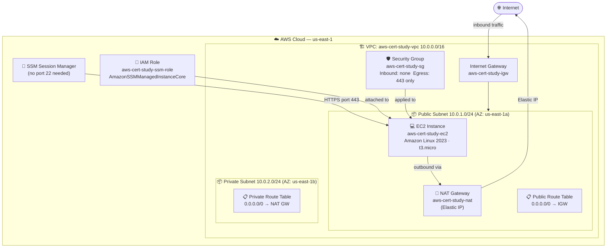
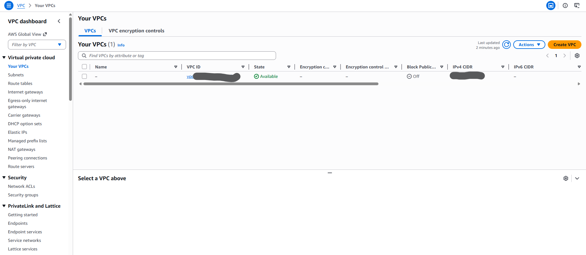

# Project 02: EC2 + VPC + Security Groups


Deploy a hardened EC2 instance inside a custom VPC with public/private subnets, proper security groups, and SSM Session Manager access — no open SSH ports, no bastion host required.

---

## Quick Start

```bash
# Deploy everything
bash scripts/deploy.sh

# Connect via SSM (no SSH key needed)
aws ssm start-session --target $INSTANCE_ID --region $AWS_REGION

# Always clean up after your session
bash scripts/cleanup.sh
```

---

## Architecture



### Key Design Decisions

| Decision | Why |
|----------|-----|
| No port 22 open | SSM Session Manager replaces SSH — no keys to manage, all sessions logged |
| NAT Gateway in public subnet | EC2 can reach the internet for updates/SSM without being directly reachable |
| EC2 in public subnet, no public IP | Gets IGW routing but we explicitly disable public IP assignment |
| Security group egress: 443 only | Least-privilege outbound — SSM only needs HTTPS |

---

## What You'll Learn

| Concept | AWS Service | Exam Domain |
|---------|-------------|-------------|
| VPC design: CIDR, subnets, route tables | VPC | Networking |
| Public vs private subnet differences | VPC | Networking |
| Internet Gateway vs NAT Gateway | VPC | Networking |
| Security Groups (stateful firewall) | EC2 | Security |
| IAM instance profiles | IAM | Security & Identity |
| Secure shell-less access | SSM | Operations |
| Resource tagging for cost allocation | All | FinOps |

---

## Resources Created

| Resource | Name | Notes |
|----------|------|-------|
| VPC | `aws-cert-study-vpc` | CIDR: 10.0.0.0/16 |
| Public Subnet | `aws-cert-study-public` | 10.0.1.0/24, AZ-a |
| Private Subnet | `aws-cert-study-private` | 10.0.2.0/24, AZ-b |
| Internet Gateway | `aws-cert-study-igw` | Attached to VPC |
| NAT Gateway | `aws-cert-study-nat` | In public subnet, uses Elastic IP |
| Public Route Table | `aws-cert-study-public-rtb` | 0.0.0.0/0 → IGW |
| Private Route Table | `aws-cert-study-private-rtb` | 0.0.0.0/0 → NAT GW |
| Security Group | `aws-cert-study-sg` | No port 22, egress 443 only |
| EC2 Instance | `aws-cert-study-ec2` | Amazon Linux 2023, t3.micro |
| IAM Role | `aws-cert-study-ssm-role` | AmazonSSMManagedInstanceCore |
| Instance Profile | `aws-cert-study-ssm-profile` | Links role to EC2 |

---

## Prerequisites

- [ ] AWS CLI v2 installed and configured
- [ ] Project 01 completed (familiarity with IAM and AWS CLI)
- [ ] Appropriate IAM permissions: EC2, VPC, IAM, SSM

```bash
# Verify authentication
aws sts get-caller-identity
export AWS_ACCOUNT_ID=$(aws sts get-caller-identity --query Account --output text)
export AWS_REGION="${AWS_REGION:-us-east-1}"
```

---

## FinOps: Cost Awareness

| Resource | Hourly Cost | Notes |
|----------|------------|-------|
| EC2 t3.micro | $0.0104/hr | Free tier: 750 hrs/month (first 12 months) |
| NAT Gateway | $0.045/hr + $0.045/GB | **Most expensive — delete immediately after lab** |
| Elastic IP | $0.005/hr when unattached | Attached to NAT GW during lab — no charge |
| VPC, Subnets, IGW, SGs | Free | No hourly cost |

> **FinOps Alert**: NAT Gateway costs ~$1.08/day. Always run `cleanup.sh` immediately after finishing.

---

## Step-by-Step Walkthrough

### Module 1: VPC Foundation

#### Concept: What Is a VPC?

A **Virtual Private Cloud (VPC)** is your isolated private network in AWS. Everything you deploy lives inside a VPC. A custom VPC gives you full control over CIDR blocks, subnets, and routing.

**Exam Note**: A VPC spans all Availability Zones in a region. Subnets live in a single AZ.

#### Step 1.1 — Create the VPC

```bash
export VPC_CIDR="10.0.0.0/16"

VPC_ID=$(aws ec2 create-vpc \
    --cidr-block "$VPC_CIDR" \
    --query 'Vpc.VpcId' --output text \
    --region "$AWS_REGION")

# Enable DNS hostnames (required for SSM)
aws ec2 modify-vpc-attribute \
    --vpc-id "$VPC_ID" \
    --enable-dns-hostnames \
    --region "$AWS_REGION"

aws ec2 create-tags --resources "$VPC_ID" --tags \
    Key=Name,Value=aws-cert-study-vpc \
    Key=Project,Value=aws-cert-study \
    Key=Environment,Value=learning \
    Key=ManagedBy,Value=manual \
    --region "$AWS_REGION"

echo "VPC_ID=$VPC_ID"
export VPC_ID
```

> **Screenshot (console):** Navigate to **VPC → Your VPCs** and take a screenshot showing your new VPC with CIDR `10.0.0.0/16` and DNS hostnames enabled.
> Save as `docs/screenshots/01-vpc-created.png`

**Exam Note**: `/16` gives you 65,536 IP addresses. AWS reserves 5 IPs per subnet (first 4 + last 1). You cannot change a VPC's primary CIDR after creation.

#### Step 1.2 — Create Public and Private Subnets

```bash
# Public subnet — us-east-1a
PUBLIC_SUBNET_ID=$(aws ec2 create-subnet \
    --vpc-id "$VPC_ID" \
    --cidr-block "10.0.1.0/24" \
    --availability-zone "${AWS_REGION}a" \
    --query 'Subnet.SubnetId' --output text \
    --region "$AWS_REGION")

aws ec2 modify-subnet-attribute \
    --subnet-id "$PUBLIC_SUBNET_ID" \
    --map-public-ip-on-launch \
    --region "$AWS_REGION"

aws ec2 create-tags --resources "$PUBLIC_SUBNET_ID" --tags \
    Key=Name,Value=aws-cert-study-public \
    Key=Project,Value=aws-cert-study \
    Key=Environment,Value=learning \
    --region "$AWS_REGION"

echo "PUBLIC_SUBNET_ID=$PUBLIC_SUBNET_ID"
export PUBLIC_SUBNET_ID

# Private subnet — us-east-1b
PRIVATE_SUBNET_ID=$(aws ec2 create-subnet \
    --vpc-id "$VPC_ID" \
    --cidr-block "10.0.2.0/24" \
    --availability-zone "${AWS_REGION}b" \
    --query 'Subnet.SubnetId' --output text \
    --region "$AWS_REGION")

aws ec2 create-tags --resources "$PRIVATE_SUBNET_ID" --tags \
    Key=Name,Value=aws-cert-study-private \
    Key=Project,Value=aws-cert-study \
    Key=Environment,Value=learning \
    --region "$AWS_REGION"

echo "PRIVATE_SUBNET_ID=$PRIVATE_SUBNET_ID"
export PRIVATE_SUBNET_ID
```

> **Screenshot (console):** Navigate to **VPC → Subnets** and take a screenshot showing both subnets with their CIDR blocks and Availability Zones.
> Save as `docs/screenshots/02-subnets-created.png`

**Exam Note**: What makes a subnet "public"? A route to an Internet Gateway. The subnet type is determined by its route table, not a setting on the subnet itself.

#### Step 1.3 — Create and Attach Internet Gateway

```bash
IGW_ID=$(aws ec2 create-internet-gateway \
    --query 'InternetGateway.InternetGatewayId' --output text \
    --region "$AWS_REGION")

aws ec2 attach-internet-gateway \
    --internet-gateway-id "$IGW_ID" \
    --vpc-id "$VPC_ID" \
    --region "$AWS_REGION"

aws ec2 create-tags --resources "$IGW_ID" --tags \
    Key=Name,Value=aws-cert-study-igw \
    Key=Project,Value=aws-cert-study \
    Key=Environment,Value=learning \
    --region "$AWS_REGION"

echo "IGW_ID=$IGW_ID"
export IGW_ID
```

**Exam Note**: An Internet Gateway is horizontally scaled, redundant, and highly available — there is no bandwidth bottleneck. One IGW per VPC maximum.

#### Step 1.4 — Create Route Tables

```bash
# Public route table: routes internet traffic through IGW
PUBLIC_RTB_ID=$(aws ec2 create-route-table \
    --vpc-id "$VPC_ID" \
    --query 'RouteTable.RouteTableId' --output text \
    --region "$AWS_REGION")

aws ec2 create-route \
    --route-table-id "$PUBLIC_RTB_ID" \
    --destination-cidr-block "0.0.0.0/0" \
    --gateway-id "$IGW_ID" \
    --region "$AWS_REGION" > /dev/null

aws ec2 associate-route-table \
    --route-table-id "$PUBLIC_RTB_ID" \
    --subnet-id "$PUBLIC_SUBNET_ID" \
    --region "$AWS_REGION" > /dev/null

aws ec2 create-tags --resources "$PUBLIC_RTB_ID" --tags \
    Key=Name,Value=aws-cert-study-public-rtb \
    Key=Project,Value=aws-cert-study \
    Key=Environment,Value=learning \
    --region "$AWS_REGION"

echo "PUBLIC_RTB_ID=$PUBLIC_RTB_ID"
export PUBLIC_RTB_ID
```

> **Screenshot (console):** Navigate to **VPC → Route Tables**, select your public route table, and take a screenshot showing the **Routes** tab with `0.0.0.0/0 → igw-xxxxx`.
> Save as `docs/screenshots/03-route-table-igw.png`

#### Step 1.5 — Create NAT Gateway

```bash
# Allocate Elastic IP for NAT Gateway
EIP_ALLOC_ID=$(aws ec2 allocate-address \
    --domain vpc \
    --query 'AllocationId' --output text \
    --region "$AWS_REGION")

echo "EIP_ALLOC_ID=$EIP_ALLOC_ID"

# Create NAT Gateway in the public subnet
NAT_GW_ID=$(aws ec2 create-nat-gateway \
    --subnet-id "$PUBLIC_SUBNET_ID" \
    --allocation-id "$EIP_ALLOC_ID" \
    --query 'NatGateway.NatGatewayId' --output text \
    --region "$AWS_REGION")

echo "NAT_GW_ID=$NAT_GW_ID — waiting ~60 seconds..."
aws ec2 wait nat-gateway-available \
    --nat-gateway-ids "$NAT_GW_ID" \
    --region "$AWS_REGION"
echo "NAT Gateway ready."

export NAT_GW_ID EIP_ALLOC_ID

# Private route table: routes outbound through NAT Gateway
PRIVATE_RTB_ID=$(aws ec2 create-route-table \
    --vpc-id "$VPC_ID" \
    --query 'RouteTable.RouteTableId' --output text \
    --region "$AWS_REGION")

aws ec2 create-route \
    --route-table-id "$PRIVATE_RTB_ID" \
    --destination-cidr-block "0.0.0.0/0" \
    --nat-gateway-id "$NAT_GW_ID" \
    --region "$AWS_REGION" > /dev/null

aws ec2 associate-route-table \
    --route-table-id "$PRIVATE_RTB_ID" \
    --subnet-id "$PRIVATE_SUBNET_ID" \
    --region "$AWS_REGION" > /dev/null

aws ec2 create-tags --resources "$PRIVATE_RTB_ID" --tags \
    Key=Name,Value=aws-cert-study-private-rtb \
    Key=Project,Value=aws-cert-study \
    Key=Environment,Value=learning \
    --region "$AWS_REGION"

echo "PRIVATE_RTB_ID=$PRIVATE_RTB_ID"
export PRIVATE_RTB_ID
```

> **Screenshot (console):** Navigate to **VPC → NAT Gateways** and take a screenshot showing your NAT Gateway with **State: Available** and its Elastic IP.
> Save as `docs/screenshots/04-nat-gateway-available.png`

**Exam Note**: Internet Gateway vs NAT Gateway:

| | Internet Gateway | NAT Gateway |
|---|---|---|
| Traffic direction | Inbound + Outbound | Outbound only |
| Who uses it | Public subnet instances | Private subnet instances |
| Public IP | Instance needs its own EIP/public IP | NAT GW has the Elastic IP |
| Cost | Free | $0.045/hr + data transfer |

---

### Module 2: Security Groups

#### Concept: Stateful Firewalls

Security Groups are **stateful** — if inbound traffic on port 80 is allowed, return traffic is automatically permitted regardless of outbound rules. This is the key difference from Network ACLs (stateless).

**Exam Note**: Security Groups operate at the instance (ENI) level. NACLs operate at the subnet level. SGs: default deny inbound, allow all outbound. NACLs: default allow all.

#### Step 2.1 — Create Security Group (No Port 22)

```bash
SG_ID=$(aws ec2 create-security-group \
    --group-name "aws-cert-study-sg" \
    --description "Lab 02 — SSM access only, no open SSH" \
    --vpc-id "$VPC_ID" \
    --query 'GroupId' --output text \
    --region "$AWS_REGION")

# Allow HTTPS outbound only (SSM requires port 443 to SSM endpoints)
aws ec2 authorize-security-group-egress \
    --group-id "$SG_ID" \
    --protocol tcp --port 443 --cidr 0.0.0.0/0 \
    --region "$AWS_REGION" > /dev/null

# Remove the default allow-all egress rule
aws ec2 revoke-security-group-egress \
    --group-id "$SG_ID" \
    --protocol -1 --port -1 --cidr 0.0.0.0/0 \
    --region "$AWS_REGION" 2>/dev/null || true

aws ec2 create-tags --resources "$SG_ID" --tags \
    Key=Name,Value=aws-cert-study-sg \
    Key=Project,Value=aws-cert-study \
    Key=Environment,Value=learning \
    --region "$AWS_REGION"

echo "SG_ID=$SG_ID"
export SG_ID
```

> **Screenshot (console):** Navigate to **EC2 → Security Groups**, select your SG, and take screenshots of:
> - **Inbound rules** tab — empty (no port 22)
> - **Outbound rules** tab — port 443 only
>
> Save as `docs/screenshots/05-security-group-rules.png`

---

### Module 3: IAM Instance Profile for SSM

#### Concept: IAM Roles vs IAM Users

An **IAM Role** is assumed by a service (like EC2) rather than a person. When EC2 has a role via an **instance profile**, it makes API calls without hardcoded credentials — the Instance Metadata Service (IMDS) provides temporary, auto-rotating credentials.

**Exam Note**: Never store AWS access keys on EC2 instances. Always use IAM roles. The `169.254.169.254` address is the IMDS endpoint — it provides the instance's temporary credentials.

#### Step 3.1 — Create IAM Role and Instance Profile

```bash
TRUST_POLICY='{
  "Version": "2012-10-17",
  "Statement": [{
    "Effect": "Allow",
    "Principal": { "Service": "ec2.amazonaws.com" },
    "Action": "sts:AssumeRole"
  }]
}'

aws iam create-role \
    --role-name "aws-cert-study-ssm-role" \
    --assume-role-policy-document "$TRUST_POLICY" \
    --tags Key=Project,Value=aws-cert-study Key=Environment,Value=learning \
    > /dev/null 2>&1 || echo "(role already exists)"

aws iam attach-role-policy \
    --role-name "aws-cert-study-ssm-role" \
    --policy-arn "arn:aws:iam::aws:policy/AmazonSSMManagedInstanceCore"

aws iam create-instance-profile \
    --instance-profile-name "aws-cert-study-ssm-profile" > /dev/null 2>&1 || true

aws iam add-role-to-instance-profile \
    --instance-profile-name "aws-cert-study-ssm-profile" \
    --role-name "aws-cert-study-ssm-role" 2>/dev/null || true

echo "IAM role ready. Waiting 10s for propagation..."
sleep 10
```

> **Screenshot (console):** Navigate to **IAM → Roles → aws-cert-study-ssm-role** and take a screenshot showing the **AmazonSSMManagedInstanceCore** policy attached.
> Save as `docs/screenshots/06-iam-role-ssm-policy.png`

---

### Module 4: EC2 Instance

#### Concept: AMIs and Instance Types

- **AMI**: Snapshot defining the OS and software for an instance
- **t3.micro**: 2 vCPU, 1 GB RAM — burstable (CPU credits accumulate when idle)
- **Nitro System**: AWS's hypervisor — near bare-metal performance, enhanced security isolation

**Exam Note**: t3 instances are burstable performance instances. They earn CPU credits at a baseline rate and spend them during bursts. Good for workloads with variable CPU demand.

#### Step 4.1 — Launch EC2 Instance

```bash
# Get latest Amazon Linux 2023 AMI
AMI_ID=$(aws ec2 describe-images \
    --owners amazon \
    --filters "Name=name,Values=al2023-ami-*-x86_64" \
              "Name=state,Values=available" \
    --query 'sort_by(Images, &CreationDate)[-1].ImageId' \
    --output text \
    --region "$AWS_REGION")

echo "AMI_ID=$AMI_ID"

# Launch the instance
INSTANCE_ID=$(aws ec2 run-instances \
    --image-id "$AMI_ID" \
    --instance-type "t3.micro" \
    --subnet-id "$PUBLIC_SUBNET_ID" \
    --security-group-ids "$SG_ID" \
    --iam-instance-profile Name="aws-cert-study-ssm-profile" \
    --no-associate-public-ip-address \
    --tag-specifications \
        "ResourceType=instance,Tags=[{Key=Name,Value=aws-cert-study-ec2},{Key=Project,Value=aws-cert-study},{Key=Environment,Value=learning},{Key=ManagedBy,Value=manual}]" \
        "ResourceType=volume,Tags=[{Key=Project,Value=aws-cert-study},{Key=Environment,Value=learning}]" \
    --query 'Instances[0].InstanceId' --output text \
    --region "$AWS_REGION")

echo "INSTANCE_ID=$INSTANCE_ID — waiting for running state..."
aws ec2 wait instance-running --instance-ids "$INSTANCE_ID" --region "$AWS_REGION"
echo "EC2 instance is running."

export INSTANCE_ID AMI_ID
```

> **Screenshot (console):** Navigate to **EC2 → Instances** and take a screenshot showing your instance with **Instance state: Running** and no public IPv4 address listed.
> Save as `docs/screenshots/07-ec2-instance-running.png`

---

### Module 5: Connect via SSM Session Manager

#### Concept: Why SSM Instead of SSH?

| | SSH | SSM Session Manager |
|---|---|---|
| Open ports required | Port 22 inbound | None |
| Key pair management | Required | Not required |
| Session logging | Manual | Automatic (CloudTrail + optional S3) |
| IAM-controlled access | No | Yes |
| Works from AWS Console | No | Yes |

#### Step 5.1 — Verify SSM Registration

```bash
# Wait ~2 minutes after launch for the SSM agent to register
echo "Waiting for SSM agent registration (this can take 1-2 minutes)..."
sleep 60

aws ssm describe-instance-information \
    --filters "Key=InstanceIds,Values=$INSTANCE_ID" \
    --query 'InstanceInformationList[0].PingStatus' \
    --output text \
    --region "$AWS_REGION"
# Expected output: Online
```

#### Step 5.2 — Open a Session

```bash
aws ssm start-session \
    --target "$INSTANCE_ID" \
    --region "$AWS_REGION"
```

Once inside, run these commands to verify the setup:

```bash
# Verify instance identity from IMDS
curl -s http://169.254.169.254/latest/meta-data/instance-id
curl -s http://169.254.169.254/latest/meta-data/instance-type

# Verify outbound internet works via NAT Gateway
curl -s https://checkip.amazonaws.com   # Should show the NAT GW Elastic IP

# Confirm no SSH port is listening
ss -tlnp | grep :22    # Should return nothing
```

> **Screenshot (console):** Navigate to **Systems Manager → Session Manager → Sessions** and take a screenshot of your active session.
> Save as `docs/screenshots/08-ssm-session-active.png`

> **Screenshot (terminal):** Take a screenshot of your SSM session terminal showing the `instance-id`, `instance-type`, and the public IP from `checkip.amazonaws.com`.
> Save as `docs/screenshots/09-ssm-session-terminal.png`

---

### Module 6: Knowledge Check — Exam Prep

**VPC Questions**:
1. What is the difference between an Internet Gateway and a NAT Gateway?
2. A subnet has a route `0.0.0.0/0 → igw-xxx`. What does this make the subnet?
3. Can a VPC span multiple AWS Regions?
4. What are the 5 IP addresses AWS reserves in every subnet?

**Security Group Questions**:
5. Are Security Groups stateful or stateless? What does that mean?
6. What is the default inbound rule for a new Security Group?
7. Can you reference another Security Group in a Security Group rule?

**EC2 / SSM Questions**:
8. Why should you use IAM roles instead of access keys on EC2 instances?
9. What AWS service provides temporary credentials to EC2 via `http://169.254.169.254`?
10. What IAM policy does an instance need to use SSM Session Manager?

---

## Cleanup — IMPORTANT

> **Cost reminder**: The NAT Gateway costs ~$1.08/day. Run cleanup immediately after finishing the lab.

### Option A — Automated (Recommended)

```bash
bash scripts/cleanup.sh
```

### Option B — Manual (Step by Step)

```bash
# 1. Terminate EC2 instance
aws ec2 terminate-instances --instance-ids "$INSTANCE_ID" --region "$AWS_REGION"
aws ec2 wait instance-terminated --instance-ids "$INSTANCE_ID" --region "$AWS_REGION"

# 2. Delete NAT Gateway
aws ec2 delete-nat-gateway --nat-gateway-id "$NAT_GW_ID" --region "$AWS_REGION"
echo "Waiting for NAT Gateway deletion (~60 seconds)..."
sleep 60

# 3. Release Elastic IP
aws ec2 release-address --allocation-id "$EIP_ALLOC_ID" --region "$AWS_REGION"

# 4. Delete Security Group
aws ec2 delete-security-group --group-id "$SG_ID" --region "$AWS_REGION"

# 5. Delete subnets
aws ec2 delete-subnet --subnet-id "$PUBLIC_SUBNET_ID" --region "$AWS_REGION"
aws ec2 delete-subnet --subnet-id "$PRIVATE_SUBNET_ID" --region "$AWS_REGION"

# 6. Detach and delete Internet Gateway
aws ec2 detach-internet-gateway --internet-gateway-id "$IGW_ID" --vpc-id "$VPC_ID" --region "$AWS_REGION"
aws ec2 delete-internet-gateway --internet-gateway-id "$IGW_ID" --region "$AWS_REGION"

# 7. Delete route tables
aws ec2 delete-route-table --route-table-id "$PUBLIC_RTB_ID" --region "$AWS_REGION"
aws ec2 delete-route-table --route-table-id "$PRIVATE_RTB_ID" --region "$AWS_REGION"

# 8. Delete VPC
aws ec2 delete-vpc --vpc-id "$VPC_ID" --region "$AWS_REGION"

# 9. Clean up IAM
aws iam remove-role-from-instance-profile \
    --instance-profile-name "aws-cert-study-ssm-profile" \
    --role-name "aws-cert-study-ssm-role"
aws iam delete-instance-profile --instance-profile-name "aws-cert-study-ssm-profile"
aws iam detach-role-policy \
    --role-name "aws-cert-study-ssm-role" \
    --policy-arn "arn:aws:iam::aws:policy/AmazonSSMManagedInstanceCore"
aws iam delete-role --role-name "aws-cert-study-ssm-role"

echo "Cleanup complete."
```

### Verify Nothing Remains

```bash
aws resourcegroupstaggingapi get-resources \
    --tag-filters Key=Project,Values=aws-cert-study \
    --query 'ResourceTagMappingList[].ResourceARN'
# Should return: []
```

> **Screenshot:** Take a screenshot of your terminal showing the empty array `[]` confirming all resources are deleted.
> Save as `docs/screenshots/10-cleanup-verified.png`

---

## Screenshots

Console screenshots captured during the lab run:

| Step | Screenshot |
|------|-----------|
| VPC created |  |
| Subnets created |  |
| Route table — IGW route |  |
| NAT Gateway available |  |
| Security Group rules (no port 22) |  |
| IAM role — SSM policy attached |  |
| EC2 instance running |  |
| SSM session — console |  |
| SSM session — terminal |  |
| Cleanup verified |  |

> See [`docs/screenshots/`](docs/screenshots/) for full-resolution images.

---

## What You Learned

- **VPC**: Custom CIDR design, subnet creation, IGW vs NAT Gateway, route tables
- **Security Groups**: Stateful firewall rules, least-privilege egress, no SSH paradigm
- **EC2**: AMI selection, instance types, Nitro system, instance metadata service
- **IAM**: Roles, instance profiles, AmazonSSMManagedInstanceCore policy
- **SSM**: Session Manager as a secure, keyless alternative to SSH
- **FinOps**: NAT Gateway cost awareness, tagging, cleanup verification

---

## Next Steps

- **Project 03**: RDS + EC2 — two-tier app with a managed database in a private subnet
- **Project 04**: Lambda + API Gateway — serverless REST API
- **Project 05**: Multi-tier with ALB, Auto Scaling, and CloudWatch dashboards

---

## Certification Relevance

| Certification | Topics Covered |
|---------------|----------------|
| AWS Cloud Practitioner (CLF-C02) | VPC basics, EC2 instance types, IAM roles, security groups |
| Solutions Architect Associate (SAA-C03) | VPC design, NAT vs IGW, SG vs NACL, SSM, instance profiles |
| SysOps Administrator (SOA-C02) | SSM Session Manager, patching, EC2 monitoring, IAM |
| Security Specialty (SCS-C02) | Zero-trust network design, no open ports, IAM least privilege |
