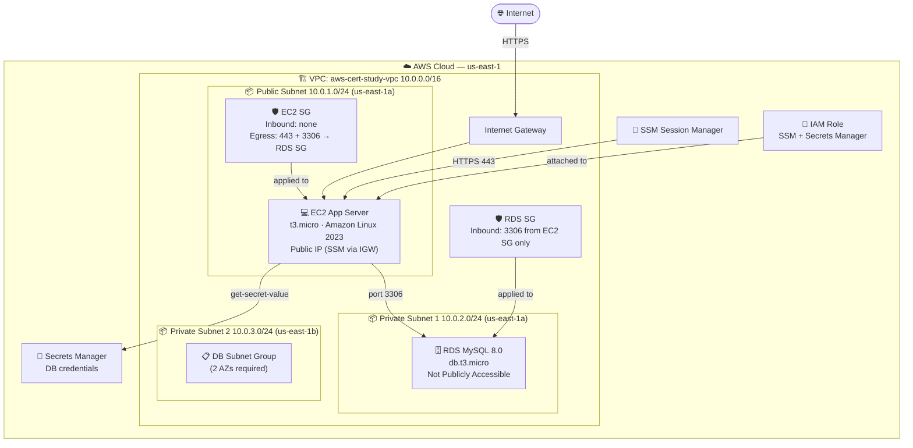

# Project 03: RDS + EC2 Two-Tier App


Deploy a two-tier architecture with an EC2 app server in a public subnet and a MySQL RDS database in private subnets. DB credentials are managed by Secrets Manager — no hardcoded passwords anywhere.

---

## Quick Start

```bash
# Deploy everything (~10 minutes — RDS takes time)
bash scripts/deploy.sh

# Connect to EC2 via SSM
aws ssm start-session --target $INSTANCE_ID --region us-east-1

# Connect to RDS from inside EC2
SECRET=$(aws secretsmanager get-secret-value \
  --secret-id aws-cert-study/lab03/db-credentials \
  --query SecretString --output text --region us-east-1)
DB_PASS=$(echo $SECRET | python3 -c "import sys,json; print(json.load(sys.stdin)['password'])")
mysql -h $RDS_ENDPOINT -u admin -p$DB_PASS labdb

# Always clean up after your session
bash scripts/cleanup.sh
```

---

## Architecture



### Key Design Decisions

| Decision | Why |
|---|---|
| EC2 in public subnet | Public IP enables SSM via IGW — no NAT Gateway cost |
| RDS in private subnets | Database never directly reachable from internet |
| 2 private subnets (2 AZs) | RDS DB subnet group requires minimum 2 AZs |
| Secrets Manager for credentials | No hardcoded passwords — credentials rotate without code changes |
| RDS SG inbound from EC2 SG | References the SG object, not an IP — secure even if EC2 IP changes |
| No multi-AZ RDS | Single-AZ for cost savings in a lab environment |
| Backup retention = 0 | Disables automated backups — faster deletion during cleanup |

---

## What You'll Learn

| Concept | AWS Service | Exam Domain |
|---|---|---|
| Two-tier architecture pattern | VPC + EC2 + RDS | Architecture |
| RDS vs self-managed databases | RDS | Database |
| DB subnet groups | RDS | Networking |
| Security group referencing | EC2 | Security |
| Secrets Manager credential retrieval | Secrets Manager | Security |
| IAM roles with multiple policies | IAM | Security & Identity |
| Private vs public accessibility | RDS | Security |

---

## Resources Created

| Resource | Name | Notes |
|---|---|---|
| VPC | `aws-cert-study-vpc` | 10.0.0.0/16, DNS enabled |
| Public Subnet | `aws-cert-study-public` | 10.0.1.0/24, us-east-1a — EC2 |
| Private Subnet 1 | `aws-cert-study-private-1` | 10.0.2.0/24, us-east-1a — RDS |
| Private Subnet 2 | `aws-cert-study-private-2` | 10.0.3.0/24, us-east-1b — RDS subnet group |
| Internet Gateway | `aws-cert-study-igw` | Public subnet outbound |
| EC2 Security Group | `aws-cert-study-ec2-sg` | No inbound, egress 443 + 3306 |
| RDS Security Group | `aws-cert-study-rds-sg` | Inbound 3306 from EC2 SG only |
| IAM Role | `aws-cert-study-lab03-role` | SSM + Secrets Manager |
| Secrets Manager | `aws-cert-study/lab03/db-credentials` | username, password, dbname |
| DB Subnet Group | `aws-cert-study-db-subnet-group` | Both private subnets |
| RDS Instance | `aws-cert-study-rds` | MySQL 8.0, db.t3.micro |
| EC2 Instance | `aws-cert-study-app-server` | t3.micro, MySQL client pre-installed |

---

## Prerequisites

- [ ] AWS CLI v2 installed and configured
- [ ] Lab 02 completed (VPC and Security Groups concepts)
- [ ] IAM permissions: EC2, RDS, VPC, IAM, Secrets Manager, SSM

```bash
aws sts get-caller-identity
export AWS_REGION="${AWS_REGION:-us-east-1}"
```

---

## FinOps: Cost Awareness

| Resource | Cost | Notes |
|---|---|---|
| EC2 t3.micro | $0.0104/hr | Free tier: 750 hrs/month first 12 months |
| RDS db.t3.micro MySQL | $0.017/hr | Free tier: 750 hrs/month first 12 months |
| RDS Storage 20 GB gp2 | $0.115/GB/month | Free tier: 20 GB included |
| Secrets Manager | $0.40/secret/month | ~$0.0005/hr — negligible |
| VPC, Subnets, IGW, SGs | Free | No hourly charges |
| **No NAT Gateway** | **$0 saved** | EC2 public IP reaches SSM via IGW directly |

> **FinOps win**: By placing EC2 in the public subnet with a public IP, we avoid the $0.045/hr NAT Gateway charge from Lab 02. SSM works via the IGW for public instances.

---

## Step-by-Step Walkthrough

### Module 1: VPC + Three Subnets

RDS requires a **DB Subnet Group** spanning at least 2 Availability Zones. Even for single-AZ RDS, AWS needs subnets in 2 AZs defined.

```bash
export AWS_REGION="us-east-1"
export AWS_ACCOUNT_ID=$(aws sts get-caller-identity --query Account --output text)

# Create VPC
VPC_ID=$(aws ec2 create-vpc \
    --cidr-block "10.0.0.0/16" \
    --query 'Vpc.VpcId' --output text --region "$AWS_REGION")
aws ec2 modify-vpc-attribute --vpc-id "$VPC_ID" --enable-dns-hostnames --region "$AWS_REGION"

# Public subnet for EC2
PUBLIC_SUBNET_ID=$(aws ec2 create-subnet \
    --vpc-id "$VPC_ID" --cidr-block "10.0.1.0/24" \
    --availability-zone "${AWS_REGION}a" \
    --query 'Subnet.SubnetId' --output text --region "$AWS_REGION")

# Two private subnets for RDS subnet group
PRIVATE_SUBNET_1_ID=$(aws ec2 create-subnet \
    --vpc-id "$VPC_ID" --cidr-block "10.0.2.0/24" \
    --availability-zone "${AWS_REGION}a" \
    --query 'Subnet.SubnetId' --output text --region "$AWS_REGION")

PRIVATE_SUBNET_2_ID=$(aws ec2 create-subnet \
    --vpc-id "$VPC_ID" --cidr-block "10.0.3.0/24" \
    --availability-zone "${AWS_REGION}b" \
    --query 'Subnet.SubnetId' --output text --region "$AWS_REGION")
```

> **Exam Note**: A DB Subnet Group must span at least 2 AZs. This allows RDS to place a standby in a different AZ if Multi-AZ is enabled.

---

### Module 2: Security Groups (SG Referencing)

The key pattern here is **security group referencing** — instead of allowing traffic from a CIDR block, the RDS SG allows traffic from the EC2 SG object itself.

```bash
# EC2 SG — no inbound, egress 443 (SSM) + 3306 (RDS)
EC2_SG_ID=$(aws ec2 create-security-group \
    --group-name "aws-cert-study-ec2-sg" \
    --description "Lab 03 - EC2 app server - SSM + MySQL egress" \
    --vpc-id "$VPC_ID" --query 'GroupId' --output text --region "$AWS_REGION")

# RDS SG — inbound 3306 from EC2 SG only
RDS_SG_ID=$(aws ec2 create-security-group \
    --group-name "aws-cert-study-rds-sg" \
    --description "Lab 03 - RDS MySQL - inbound from EC2 SG only" \
    --vpc-id "$VPC_ID" --query 'GroupId' --output text --region "$AWS_REGION")

# Allow MySQL inbound from EC2 SG (SG reference, not CIDR)
aws ec2 authorize-security-group-ingress \
    --group-id "$RDS_SG_ID" \
    --protocol tcp --port 3306 \
    --source-group "$EC2_SG_ID" \
    --region "$AWS_REGION"
```

> **Exam Note**: SG referencing is more secure than CIDR-based rules. If the EC2 instance's IP changes (e.g., after stop/start), the rule still applies because it references the SG, not the IP.

---

### Module 3: Secrets Manager

Never put database passwords in code or environment variables. Secrets Manager stores them encrypted and allows fine-grained IAM access control.

```bash
DB_PASSWORD=$(openssl rand -base64 16 | tr -dc 'A-Za-z0-9' | head -c 20)

SECRET_ARN=$(aws secretsmanager create-secret \
    --name "aws-cert-study/lab03/db-credentials" \
    --secret-string "{\"username\":\"admin\",\"password\":\"$DB_PASSWORD\",\"dbname\":\"labdb\"}" \
    --query 'ARN' --output text --region "$AWS_REGION")

# Retrieve from EC2 later:
# aws secretsmanager get-secret-value \
#   --secret-id aws-cert-study/lab03/db-credentials \
#   --query SecretString --output text
```

> **Exam Note**: Secrets Manager supports automatic rotation. When you enable rotation, Secrets Manager automatically updates the secret and updates the database password on a schedule — zero downtime.

---

### Module 4: RDS Instance

```bash
# DB Subnet Group (required for RDS in VPC)
aws rds create-db-subnet-group \
    --db-subnet-group-name "aws-cert-study-db-subnet-group" \
    --db-subnet-group-description "Lab 03 private subnets" \
    --subnet-ids "$PRIVATE_SUBNET_1_ID" "$PRIVATE_SUBNET_2_ID" \
    --region "$AWS_REGION"

# RDS MySQL instance
aws rds create-db-instance \
    --db-instance-identifier "aws-cert-study-rds" \
    --db-instance-class "db.t3.micro" \
    --engine mysql \
    --engine-version "8.0" \
    --master-username admin \
    --master-user-password "$DB_PASSWORD" \
    --db-name labdb \
    --allocated-storage 20 \
    --storage-type gp2 \
    --no-multi-az \
    --no-publicly-accessible \
    --db-subnet-group-name "aws-cert-study-db-subnet-group" \
    --vpc-security-group-ids "$RDS_SG_ID" \
    --backup-retention-period 0 \
    --region "$AWS_REGION"

# Wait ~8 minutes
aws rds wait db-instance-available \
    --db-instance-identifier "aws-cert-study-rds" \
    --region "$AWS_REGION"
```

> **Exam Note**: `--no-publicly-accessible` means the RDS instance has no public IP. Even if the RDS SG allowed all traffic, the database would still be unreachable from the internet.

---

### Module 5: Connect and Test

```bash
# 1. Connect to EC2 via SSM
aws ssm start-session --target $INSTANCE_ID --region us-east-1

# 2. Retrieve credentials from Secrets Manager
SECRET=$(aws secretsmanager get-secret-value \
    --secret-id aws-cert-study/lab03/db-credentials \
    --query SecretString --output text --region us-east-1)
DB_PASS=$(echo $SECRET | python3 -c "import sys,json; print(json.load(sys.stdin)['password'])")

# 3. Connect to MySQL
mysql -h <RDS_ENDPOINT> -u admin -p$DB_PASS labdb

# 4. Run SQL commands
SHOW DATABASES;
CREATE TABLE users (id INT AUTO_INCREMENT PRIMARY KEY, name VARCHAR(50), created_at TIMESTAMP DEFAULT CURRENT_TIMESTAMP);
INSERT INTO users (name) VALUES ('Omie'), ('Lab03'), ('AWS');
SELECT * FROM users;
SHOW TABLES;
EXIT;
```

---

### Module 6: Knowledge Check

1. Why does RDS require a DB Subnet Group with 2 AZs?
2. What is the difference between `--publicly-accessible` and `--no-publicly-accessible`?
3. How does SG referencing work? Why is it better than CIDR-based rules?
4. Why do we store DB credentials in Secrets Manager instead of an environment variable?
5. This lab uses no NAT Gateway — how does EC2 reach SSM endpoints?
6. What is the purpose of `--backup-retention-period 0` in the lab?
7. Which IAM policies does the EC2 instance need for this lab?

---

## Cleanup — IMPORTANT

```bash
bash scripts/cleanup.sh
```

Cleanup order matters:
1. Terminate EC2
2. Delete RDS (~5 min)
3. Delete DB Subnet Group
4. Delete Secrets Manager secret (force delete)
5. Delete IGW, subnets, route tables, SGs, VPC
6. Delete IAM role + instance profile

Verify:

```bash
aws resourcegroupstaggingapi get-resources \
    --tag-filters Key=Project,Values=aws-cert-study \
    --query 'ResourceTagMappingList[].ResourceARN'
# Should return: []
```

---

## Screenshots

| Step | Screenshot |
|---|---|
| VPC + 3 subnets | `docs/screenshots/01-vpc-subnets.png` |
| EC2 SG rules | `docs/screenshots/02-ec2-sg-rules.png` |
| RDS SG rules (inbound from EC2 SG) | `docs/screenshots/03-rds-sg-rules.png` |
| Secrets Manager secret | `docs/screenshots/04-secrets-manager.png` |
| RDS instance available | `docs/screenshots/05-rds-available.png` |
| EC2 instance running | `docs/screenshots/06-ec2-running.png` |
| SSM session active | `docs/screenshots/07-ssm-session.png` |
| MySQL connected to RDS | `docs/screenshots/08-mysql-connected.png` |
| SQL commands output | `docs/screenshots/09-sql-output.png` |
| Cleanup verified | `docs/screenshots/10-cleanup-verified.png` |

---

## What You Learned

- **Two-tier architecture** — separation of app tier (EC2) and data tier (RDS) at the subnet and SG level
- **RDS** — managed MySQL, DB subnet groups, private accessibility, automated storage management
- **Security Group referencing** — SG-to-SG rules that follow the instance, not the IP
- **Secrets Manager** — encrypted credential storage, IAM-controlled retrieval, rotation-ready
- **FinOps** — avoided NAT Gateway cost by using public EC2 with IGW for SSM access

---

## Next Steps

- **Project 04**: Lambda + API Gateway — serverless REST API
- **Project 05**: Multi-tier with ALB, Auto Scaling, and CloudWatch dashboards
