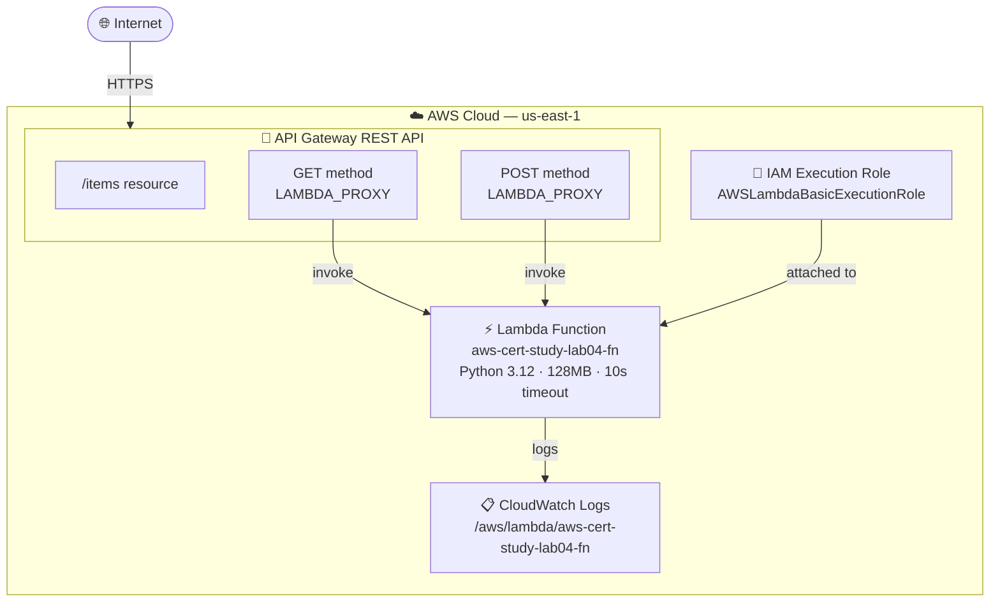

# Project 04: Lambda + API Gateway


Deploy a serverless REST API using AWS Lambda (Python 3.12) and API Gateway. No servers to manage — Lambda scales automatically and you pay only for what you use. Genuinely free at lab volumes.

---

## Quick Start

```bash
# Deploy everything (~2 minutes — no RDS wait!)
bash scripts/deploy.sh

# Test the API
curl -s https://<api-id>.execute-api.us-east-1.amazonaws.com/lab/items | python3 -m json.tool

# Create a new item
curl -s -X POST \
  -H 'Content-Type: application/json' \
  -d '{"name": "EKS Cluster", "type": "compute"}' \
  https://<api-id>.execute-api.us-east-1.amazonaws.com/lab/items | python3 -m json.tool

# Always clean up after your session
bash scripts/cleanup.sh
```

---

## Architecture



### Key Design Decisions

| Decision | Why |
|---|---|
| REST API (not HTTP API) | Covers more exam topics: stages, resources, methods, deployment model |
| LAMBDA_PROXY integration | Passes raw event to Lambda — no mapping templates needed, full control in Python |
| Python 3.12 runtime | Current LTS, fast cold starts, familiar syntax |
| 128MB memory | Minimum viable for this workload — Lambda pricing is memory × duration |
| No auth (NONE) | Lab simplicity — production would use Cognito, IAM auth, or API keys |
| Single Lambda for all methods | Demonstrates routing logic inside Lambda handler |

---

## What You'll Learn

| Concept | AWS Service | Exam Domain |
|---|---|---|
| Serverless compute model | Lambda | Compute |
| Function packaging and deployment | Lambda | Compute |
| REST API structure: resources, methods | API Gateway | Application Integration |
| LAMBDA_PROXY integration | API Gateway | Application Integration |
| API stages and deployments | API Gateway | Application Integration |
| Lambda execution roles | IAM | Security & Identity |
| Automatic log streaming | CloudWatch Logs | Monitoring |

---

## Resources Created

| Resource | Name | Notes |
|---|---|---|
| IAM Role | `aws-cert-study-lab04-role` | Lambda trust policy + AWSLambdaBasicExecutionRole |
| Lambda Function | `aws-cert-study-lab04-fn` | Python 3.12, 128MB, 10s timeout, STAGE=lab04 |
| API Gateway REST API | `aws-cert-study-lab04-api` | Regional endpoint, /items resource |
| API Stage | `lab` | Deployed stage — forms the invoke URL |
| CloudWatch Log Group | `/aws/lambda/aws-cert-study-lab04-fn` | Auto-created on first invocation |

---

## Prerequisites

- [ ] AWS CLI v2 installed and configured
- [ ] Lab 01–03 completed (IAM, networking, and managed services concepts)
- [ ] IAM permissions: Lambda, API Gateway, IAM, CloudWatch Logs

```bash
aws sts get-caller-identity
export AWS_REGION="${AWS_REGION:-us-east-1}"
```

---

## FinOps: Cost Awareness

| Resource | Cost | Notes |
|---|---|---|
| Lambda requests | $0.20 per 1M requests | **Free tier: 1M requests/month — forever** |
| Lambda compute | $0.0000166667 per GB-second | **Free tier: 400,000 GB-seconds/month — forever** |
| API Gateway REST API | $3.50 per million API calls | Free tier: 1M calls/month first 12 months |
| CloudWatch Logs | $0.50/GB ingested | Free tier: 5GB/month |

> **FinOps win**: Lambda free tier (1M requests + 400K GB-seconds) is permanent — not just the first 12 months. At lab volumes (dozens of invocations), cost is genuinely **$0.00**. Compare this to EC2 t3.micro at $0.0104/hr regardless of load.

---

## Step-by-Step Walkthrough

### Module 1: IAM Execution Role

Lambda needs permission to write logs to CloudWatch. The execution role grants this with the `AWSLambdaBasicExecutionRole` managed policy.

```bash
export AWS_REGION="us-east-1"

# Create role with Lambda trust policy
TRUST_POLICY='{
  "Version": "2012-10-17",
  "Statement": [{
    "Effect": "Allow",
    "Principal": { "Service": "lambda.amazonaws.com" },
    "Action": "sts:AssumeRole"
  }]
}'

aws iam create-role \
    --role-name "aws-cert-study-lab04-role" \
    --assume-role-policy-document "$TRUST_POLICY"

aws iam attach-role-policy \
    --role-name "aws-cert-study-lab04-role" \
    --policy-arn "arn:aws:iam::aws:policy/service-role/AWSLambdaBasicExecutionRole"

ROLE_ARN=$(aws iam get-role \
    --role-name "aws-cert-study-lab04-role" \
    --query 'Role.Arn' --output text)

# Wait for IAM propagation before using the role
sleep 10
```

> **Exam Note**: Lambda execution roles use a **trust policy** that allows `lambda.amazonaws.com` to assume the role. The attached permission policies then control what the Lambda function can do (write logs, call DynamoDB, etc.).

---

### Module 2: Lambda Function

Package the Python handler and deploy it. Lambda uses a zip deployment package containing `handler.py`.

```bash
# Create the zip package
cat > /tmp/handler.py << 'EOF'
import json, os

ITEMS = [
    {"id": 1, "name": "EC2 Instance", "type": "compute"},
    {"id": 2, "name": "S3 Bucket", "type": "storage"},
    {"id": 3, "name": "RDS Database", "type": "database"},
]

def lambda_handler(event, context):
    method = event.get("httpMethod", "GET")
    if method == "GET":
        return {"statusCode": 200, "headers": {"Content-Type": "application/json"},
                "body": json.dumps({"items": ITEMS, "count": len(ITEMS),
                                    "stage": os.environ.get("STAGE", "unknown")})}
    elif method == "POST":
        body = json.loads(event.get("body") or "{}")
        new_item = {"id": len(ITEMS)+1, "name": body.get("name","Unnamed"), "type": body.get("type","unknown")}
        ITEMS.append(new_item)
        return {"statusCode": 201, "headers": {"Content-Type": "application/json"},
                "body": json.dumps({"created": new_item, "total": len(ITEMS)})}
    else:
        return {"statusCode": 405, "body": json.dumps({"error": "Method not allowed"})}
EOF

cd /tmp && zip -q function.zip handler.py

# Deploy
FUNCTION_ARN=$(aws lambda create-function \
    --function-name "aws-cert-study-lab04-fn" \
    --runtime python3.12 \
    --role "$ROLE_ARN" \
    --handler handler.lambda_handler \
    --zip-file fileb:///tmp/function.zip \
    --memory-size 128 \
    --timeout 10 \
    --environment "Variables={STAGE=lab04}" \
    --query 'FunctionArn' --output text \
    --region "$AWS_REGION")
```

> **Exam Note**: The handler format is `filename.function_name`. For `handler.lambda_handler`, Lambda looks for `handler.py` and calls the `lambda_handler` function inside it. The function receives `event` (API Gateway request) and `context` (runtime metadata).

---

### Module 3: API Gateway REST API

Create the REST API structure: API → resource → methods → integrations.

```bash
# Create REST API
API_ID=$(aws apigateway create-rest-api \
    --name "aws-cert-study-lab04-api" \
    --endpoint-configuration types=REGIONAL \
    --query 'id' --output text --region "$AWS_REGION")

# Get root resource ID (the "/" path)
ROOT_ID=$(aws apigateway get-resources \
    --rest-api-id "$API_ID" \
    --query 'items[?path==`/`].id' --output text --region "$AWS_REGION")

# Create /items resource
ITEMS_ID=$(aws apigateway create-resource \
    --rest-api-id "$API_ID" \
    --parent-id "$ROOT_ID" \
    --path-part "items" \
    --query 'id' --output text --region "$AWS_REGION")

# Create GET method (no auth)
aws apigateway put-method \
    --rest-api-id "$API_ID" --resource-id "$ITEMS_ID" \
    --http-method GET --authorization-type NONE --region "$AWS_REGION"

# Wire GET to Lambda via PROXY integration
aws apigateway put-integration \
    --rest-api-id "$API_ID" --resource-id "$ITEMS_ID" \
    --http-method GET --type AWS_PROXY --integration-http-method POST \
    --uri "arn:aws:apigateway:${AWS_REGION}:lambda:path/2015-03-31/functions/${FUNCTION_ARN}/invocations" \
    --region "$AWS_REGION"
```

> **Exam Note**: The integration HTTP method is always `POST` for Lambda, regardless of what the API method is. This is because API Gateway calls the Lambda invoke API endpoint using POST internally.

---

### Module 4: Deploy + Test

Add Lambda invoke permissions, deploy the API to a stage, and test with curl.

```bash
# Grant API Gateway permission to invoke Lambda
aws lambda add-permission \
    --function-name "aws-cert-study-lab04-fn" \
    --statement-id "apigw-get-items" \
    --action "lambda:InvokeFunction" \
    --principal apigateway.amazonaws.com \
    --source-arn "arn:aws:execute-api:${AWS_REGION}:${AWS_ACCOUNT_ID}:${API_ID}/*/GET/items"

# Deploy API to stage
aws apigateway create-deployment \
    --rest-api-id "$API_ID" \
    --stage-name "lab" \
    --region "$AWS_REGION"

# Test it
INVOKE_URL="https://${API_ID}.execute-api.${AWS_REGION}.amazonaws.com/lab/items"

# GET all items
curl -s "$INVOKE_URL" | python3 -m json.tool

# POST a new item
curl -s -X POST \
  -H 'Content-Type: application/json' \
  -d '{"name": "EKS Cluster", "type": "compute"}' \
  "$INVOKE_URL" | python3 -m json.tool
```

---

### Module 5: Knowledge Check

1. What is the difference between a REST API and HTTP API in API Gateway?
2. Why does the integration HTTP method have to be POST even for GET requests?
3. What is LAMBDA_PROXY integration? How does it differ from LAMBDA (non-proxy)?
4. What is a cold start? When does it happen and how can you reduce it?
5. Why does Lambda need an execution role? What does `AWSLambdaBasicExecutionRole` grant?
6. What happens to a Lambda function's in-memory state between invocations? Between cold starts?
7. What is an API Gateway stage? What is a deployment?
8. How does API Gateway know which Lambda function to invoke?

---

## Cleanup — IMPORTANT

```bash
bash scripts/cleanup.sh
```

Cleanup order:
1. Delete API Gateway REST API (all stages and deployments deleted with it)
2. Remove Lambda permission statements
3. Delete Lambda function
4. Detach policies and delete IAM role

Verify:

```bash
aws resourcegroupstaggingapi get-resources \
    --tag-filters Key=Project,Values=aws-cert-study \
    --query 'ResourceTagMappingList[].ResourceARN'
# Should return: []
```

---

## Screenshots

| Step | Screenshot |
|---|---|
| IAM role created | `docs/screenshots/01-iam-role.png` |
| Lambda function deployed | `docs/screenshots/02-lambda-fn.png` |
| API Gateway REST API | `docs/screenshots/03-api-gateway.png` |
| /items resource + methods | `docs/screenshots/04-resources-methods.png` |
| Stage deployment | `docs/screenshots/05-deployment.png` |
| curl GET response | `docs/screenshots/06-get-test.png` |
| curl POST response | `docs/screenshots/07-post-test.png` |
| Cleanup verified | `docs/screenshots/08-cleanup-verified.png` |

---

## What You Learned

- **Serverless compute** — Lambda removes server management entirely; you ship code and AWS handles capacity, patching, and scaling
- **Lambda execution model** — handler function, event/context parameters, response format required by API Gateway PROXY integration
- **API Gateway REST API structure** — REST APIs, resources, methods, integrations, stages, and deployments as separate AWS objects
- **LAMBDA_PROXY integration** — the entire HTTP request is forwarded to Lambda as a JSON event; the response must be a structured dict with statusCode, headers, body
- **IAM execution roles** — Lambda assumes the role on every invocation; the role controls what AWS services Lambda can call
- **FinOps** — Lambda free tier (1M requests + 400K GB-seconds) is permanent and makes serverless genuinely free at lab and small-scale production volumes

---

## Next Steps

- **Project 05**: Multi-tier with ALB, Auto Scaling, and CloudWatch dashboards
